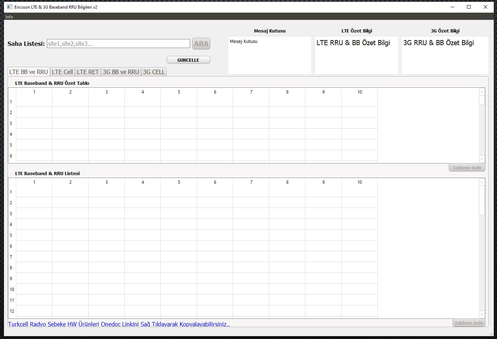
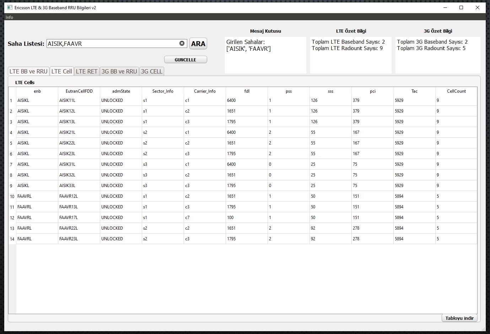

# EqiupmentInfoExe
You can find source codes of the executable file that provides to bring equipment information quickly

I developed this exe 3 years ago. This is the latest version of its.

Right now, I don't have authentication to run.  I'm sharing its source codes just to give you an idea about my developments. I've also added some screen shots to visualize their outputs. 

I wrote the code in Python and I use mainly the pandas libraries.
After that, to visualize and to have interactions with users, I turned these code into an  executable file with the power of PyQt5. 

## Purpose
It is used to bring LTE & UMTS Equipment (nodeb or enodeb) and RRU information of Ericsson in the field from files exported in the common area, in single or multiple lists, without the need for extra connection to Mobile Network equipment.

## Benefits
It can work without the need for any program installation.

While it takes about 2 minutes to connect per cabinet (nodeb or enodeb), information can be retrieved in seconds with this .exe file. It saves a lot of time, especially in bulk lists.

Baseband and RRU information in a cabinet can be viewed both in summary and in detail, and can be downloaded as an excel file if desired.

In case of need, a link containing the required documents of the equipment is given as easily accessible.

The frequency spectrum of the 3 operators in Turkey and the band information of this spectrum are also attached as a picture.

